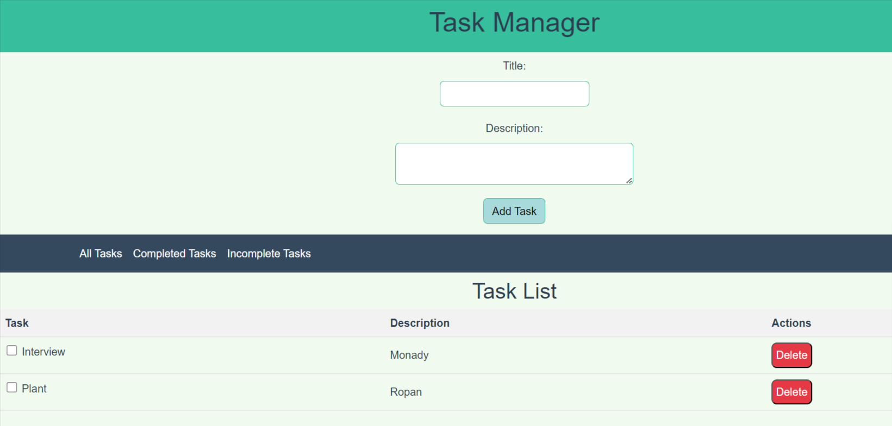

# Vue.js Task Manager


## Overview

The Vue.js Task Manager is a simple web application that allows users to create and manage tasks. It's built with Vue.js and provides features for adding, editing, and deleting tasks.




## Features

- Create new tasks with titles and descriptions.
- Mark tasks as completed or incomplete.
- Delete tasks.
- View all tasks or filter by completion status.
- Data persistence using local storage.

## Technologies Used

- **Vue.js**: A progressive JavaScript framework for building user interfaces.
- **Vue Router**: The official router for Vue.js applications.
- **Bootstrap**: A popular CSS framework for styling web applications.
- **Local Storage**:  Feature used for data persistence.

## Getting Started

### Prerequisites

- Node.js and npm (Node Package Manager) must be installed on your machine. You can download and install them from [nodejs.org](https://nodejs.org/).

### Installation

1. Clone the repository to your local machine:

   ```shell
   git clone https://github.com/hayattofficial/ToDo-App.git

2. Navigate to the project folder:
    ```shell
   cd TODO-APP

3. Install project dependencies:
    ```shell
   npm install

4. Start the development server:
    ```shell
   npm run serve

5. Open your web browser and access the application at http://localhost:8080.


## Usage
Add a Task: Click "Add Task," provide a title and description, and click "Add Task" to create a new task.

Mark as Completed: Toggle the checkbox to mark tasks as completed or incomplete.

Delete a Task: Click "Delete" to remove a task.

View Tasks: Use navigation links to filter tasks by completion status.


## Author
Sohail Hayat
